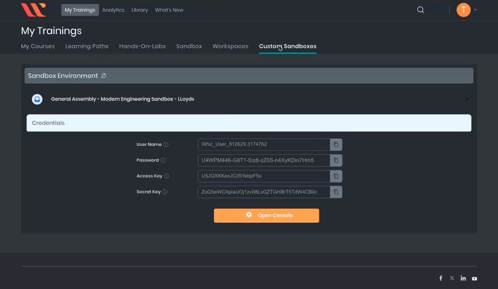

<h1>
  <span class="headline">Infrastructure As Code: Ansible & Terraform Lab</span>
  <span class="subhead">Setup</span>
</h1>

## Setup

## Configuring AWS credentials

First things first. Before Terraform can interact with AWS services, you need to configure your AWS credentials. This allows us to connect to AWS from the CLI.

### Get AWS access keys from Whizlabs

> **_Pro tip: Log in to Whizlabs from your Amazon Workspace VM. The AWS Access Keys are very long and complex. You should copy and paste them directly from the browser into your terminal. Do not attempt to type them manually—typos are almost guaranteed and will cause authentication failures, requiring you to repeat this step._**

#### 1. On your Amazon Workspace virtual machine, open a web browser.

#### 2. Navigate to the Whizlabs training dashboard: [https://business.whizlabs.com/learn/my-training/](https://business.whizlabs.com/learn/my-training/)

- You'll find the access keys you need in your **Whizlabs Custom Sandbox**.

- Once the sandbox environment loads, you should see your `AWS Access Key ID` and `AWS Secret Access Key` displayed on the screen.
- These credentials are required for configuring your AWS CLI.

<br>



<br>

#### 3. Back in your terminal window type:

```bash
aws configure
```

#### 4. You will be prompted to enter your AWS credentials and default region settings...

```plaintext
*** Example Only ***

[your-workstation-987541-1235qa-c80z56]$  aws configure
AWS Access Key ID [None]:  AKIAJWTHXU9P44LFQMLK
AWS Secret Access Key [None]:  bXrTqVyW9nJ784Tp5PLMSxwruNYdCR3kOzFpAZEm
Default region name [None]:  us-east-1
Default output format [None]:
[your-workstation-987541-1235qa-c80z56]$
```

> **_Copy and Paste: The access keys are long and complex. Avoid typing them manually to prevent errors._**

#### 5. Verify Your Configuration

If you think you entered an incorrect value you can check your AWS config file by typing the command:

```bash
cat ~/.aws/credentials
```

This will print the contents of your `.aws` config file to your terminal so that you can verify the correct values were entered:

```bash
aws_access_key_id = YOUR_ACCESS_KEY_ID
aws_secret_access_key = YOUR_SECRET_ACCESS_KEY
...
```

Ensure that both the `Access Key ID` and `Secret Access Key` match the ones provided by Whizlabs.

If there is an error you can reenter the credentials by typing:

```bash
aws configure
```

and completing the process again.

## Create Lab Files

1. **Navigate** to the `Desktop` on your workstation and create a new directory.

   ```bash
   cd ~/Desktop
   mkdir terraform-lab-01
   cd terraform-lab-01
   ```

2. **Create and open a new file** in VS Code named `rds.tf`:

   ```bash
   code rds.tf
   ```
